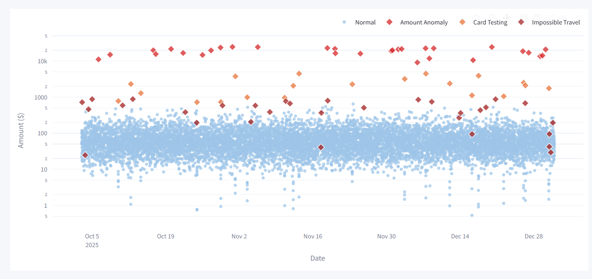
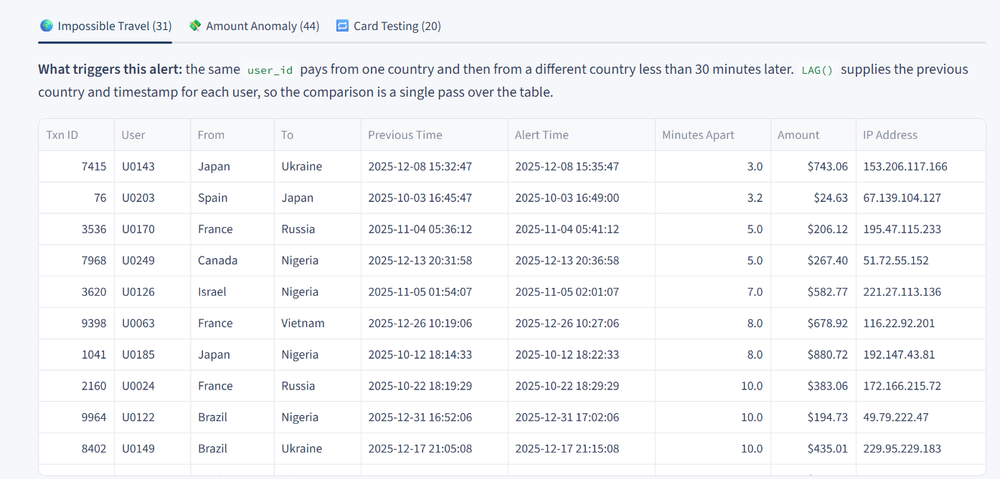
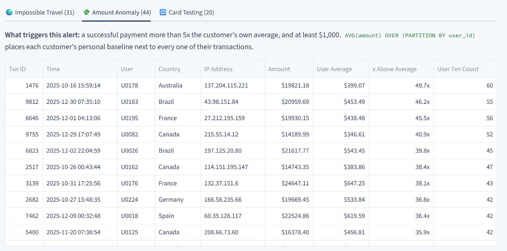
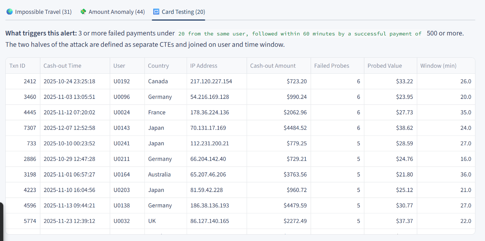

# 🛡️ Financial Fraud Detection Dashboard

An end-to-end fraud monitoring project: synthetic payment data → SQLite → SQL detection rules → an interactive Streamlit dashboard for investigators.

All detection logic is written in **SQL** (CTEs and window functions), so it could be lifted straight into a production data warehouse. Python is used only to generate the data and to present the results.

**Stack:** Python · SQLite · SQL (window functions) · pandas · Plotly · Streamlit

---

## The dashboard



Every one of the 10,000 transactions plotted over 90 days. Normal activity forms the light-blue band; each detection rule surfaces its alerts as coloured diamonds above it. The amount axis is logarithmic by default — most payments are small, so a linear scale would flatten the normal population into an unreadable line. The cash-out anomalies sit an order of magnitude above everything else, which is exactly the separation a fraud rule is looking for.

---

## Quick start

```bash
pip install -r requirements.txt
```

```bash
python generate_data.py
```

```bash
streamlit run app.py
```

The dashboard opens at `http://localhost:8501`.

`generate_data.py` is safely repeatable — it rebuilds `transactions.db` from scratch on every run, and uses a fixed random seed so the dataset is identical each time.

---

## Project structure

| File | Purpose |
|---|---|
| `generate_data.py` | Generates 10,000 synthetic transactions and injects the 3 fraud patterns into `transactions.db` |
| `app.py` | The 3 SQL detection rules + the Streamlit dashboard |
| `.streamlit/config.toml` | Forces the corporate light theme regardless of the viewer's OS setting |
| `requirements.txt` | pandas, plotly, streamlit |
| `transactions.db` | Generated SQLite database (created by `generate_data.py`) |

### Data model

A single `transactions` table:

| Column | Type | Notes |
|---|---|---|
| `transaction_id` | INTEGER | Primary key, increases with time |
| `timestamp` | TEXT | `YYYY-MM-DD HH:MM:SS` — the format SQLite's date functions understand |
| `user_id` | TEXT | 250 distinct customers, each anchored to one home country |
| `ip_address` | TEXT | Usually from the user's habitual network range |
| `country` | TEXT | |
| `amount` | REAL | Log-normal distribution: many small payments, few large ones |
| `status` | TEXT | `success` / `failed` (~4% of normal traffic fails) |

Indexed on `(user_id, timestamp)` and `status` — the columns the detection queries filter and sort by.

---

## The three detection rules

### 1. Impossible Travel — account takeover

The same `user_id` pays from one country and then from a different country **less than 30 minutes later**. No flight covers that distance, so two different people are almost certainly using the same account.

`LAG()` places each user's previous country and timestamp on the same row, so the comparison is a single pass over the table:

```sql
LAG(country)   OVER (PARTITION BY user_id ORDER BY timestamp) AS previous_country,
LAG(timestamp) OVER (PARTITION BY user_id ORDER BY timestamp) AS previous_timestamp
```

`julianday()` returns a value in days, so the difference is multiplied by `24 * 60` to get minutes.



The queue is sorted by minutes between the two payments, so the least explicable cases sit at the top — Japan → Ukraine in 3 minutes, Spain → Japan in 3.2. Showing both countries, both timestamps and the foreign IP side by side means an investigator can make a decision without running a single query of their own.

### 2. Amount Anomaly — cash-out on a compromised account

A successful payment above **5x the customer's own average**, and at least **$1,000**.

The key idea is that the baseline is *personal*, not global — $15,000 is routine for a business account and extreme for someone who usually spends $60:

```sql
AVG(amount) OVER (PARTITION BY user_id) AS user_avg_amount,
COUNT(*)    OVER (PARTITION BY user_id) AS user_tx_count
```

Two guard rails keep the alert queue realistic: a minimum of 5 transactions of history (so the average is meaningful) and a $1,000 floor (so "5x of $2" never alerts).



Each row carries the evidence for the ratio, not just the verdict: the flagged amount, the customer's own average, the multiple, and how many transactions that average is built from. A $19,821 payment from a customer who averages $399 across 60 transactions is a defensible alert; the same amount from a customer with four transactions of history would not be, which is what the minimum-history guard rail enforces.

### 3. Card Testing — stolen card enumeration

**3 or more** failed payments under **$20**, followed within **60 minutes** by a successful payment of **$500+**.

The attack has two halves, so the query has two small CTEs — `failed_attempts` (the tiny "is this card alive?" probes) and `large_success` (the cash-out) — joined on user and time window. `HAVING COUNT(*) >= 3` requires a genuine burst rather than a single mistyped CVV.

This is deliberately written as a readable CTE join rather than a nested correlated subquery.



The economics of the attack are visible in a single row: five or six probes worth around $30 in total, then a cash-out of $723 to $4,485 within half an hour. The `Failed Probes`, `Probed Value` and `Window (min)` columns are aggregates the SQL computes for exactly this purpose — an investigator can see the whole attack without opening the underlying transactions.

---

## Results

Against the 10,000-row dataset:

| Rule | Cases injected | Alerts raised | False positives |
|---|---|---|---|
| Impossible Travel | 25 | **31** | 6 |
| Amount Anomaly | 30 | **44** | 14 |
| Card Testing | 20 | **20** | 0 |

**Totals:** 10,000 transactions · 81 unique transactions flagged · ~$608K at risk · **0.81% anomaly rate**

The false positives are intentional, not defects. The generator builds legitimate noise into the data — around 3% of normal payments happen while a customer is genuinely travelling, and some customers genuinely make one large purchase. Card testing catches 20/20 cleanly because the behavioural pattern is unique; the other two rules trade precision for recall.

That trade-off is the point of the project. Every threshold is documented in the dashboard sidebar as an explicit tuning surface: tighten to reduce analyst workload, loosen to increase coverage.

---

## Dashboard features

- **KPI header** — total transactions, anomalies found, total amount at risk, anomaly rate
- **Scatter plot** — every transaction over time, with a log-scale toggle and a "hide normal transactions" toggle for reviewing alerts in isolation
- **Three alert queues** — one tab per rule, each shown above, sorted so the most suspicious cases surface first
- **Sidebar rule reference** — every threshold documented in business language, positioned as the tuning surface of the system

---

## Known limitations

Honest notes on what a production version would change:

- **Distance is not measured.** The impossible-travel rule treats *any* country change within 30 minutes as impossible. That is correct for this dataset, but in production Belgium → Netherlands in 25 minutes is an ordinary train ride. The fix is a country-coordinates table and a haversine distance, with a minimum feasible travel time. It was left out to keep the SQL readable.
- **Static thresholds.** The 5x multiplier and $1,000 floor are hand-tuned. A production system would derive them per-segment, or use a rolling z-score, and re-tune them from confirmed-fraud feedback.
- **The average includes the outlier.** `AVG() OVER (PARTITION BY user_id)` includes the anomalous payment itself, which slightly dampens the ratio. With ~50 transactions per user the effect is small; a median or a leave-one-out average would be stricter.
- **Rules, not machine learning.** Rule-based detection is transparent and explainable to a regulator, which is why it remains the backbone of real fraud teams — but it only catches patterns someone has already thought of. A supervised model over these same features would be the natural next step.
- **Synthetic data.** The fraud patterns were injected by the generator, so detection rates here are not an estimate of real-world performance.

---

## What this project demonstrates

- SQL window functions (`LAG`, `AVG() OVER`, `COUNT() OVER`) applied to a real analytical problem
- Readable, explainable query design using CTEs — logic an investigator or auditor can follow
- Understanding of three genuine fraud typologies and the behavioural signal behind each
- Awareness of precision/recall trade-offs and alert fatigue in a fraud operations context
- Turning analysis into a usable investigator tool rather than a notebook
